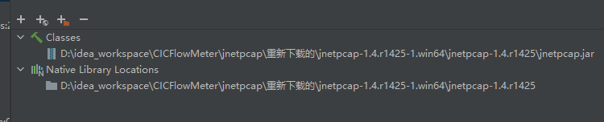
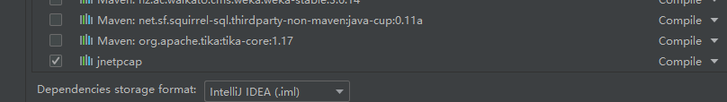

## Install jnetpcap local repo

for linux, sudo is a prerequisite
```
//linux :at the pathtoproject/jnetpcap/linux/jnetpcap-1.4.r1425
//windows: at the pathtoproject/jnetpcap/win/jnetpcap-1.4.r1425
mvn install:install-file -Dfile=jnetpcap.jar -DgroupId=org.jnetpcap -DartifactId=jnetpcap -Dversion=1.4.1 -Dpackaging=jar
```

## Run
### IntelliJ IDEA
open a Terminal in the IDE
```
//linux:
$ sudo bash
$ ./gradlew execute

//windows:
$ gradlew execute
```
### Eclipse

Run eclipse with sudo
```
1. Right click App.java -> Run As -> Run Configurations -> Arguments -> VM arguments:
-Djava.library.path="pathtoproject/jnetpcap/linux/jnetpcap-1.4.r1425"  -> Run

2. Right click App.java -> Run As -> Java Application

```

## Make package

### IntelliJ IDEA
open a Terminal in the IDE
```
//linux:
$ ./gradlew distZip
//window
$ gradlew distZip
```
the zip file will be in the pathtoproject/CICFlowMeter/build/distributions

### Eclipse
At the project root
```
mvn package
```
the jar file will be in the pathtoproject/CICFlowMeter/target


### 补充，使用mvn，windows11环境
1. 直接运行是运行不了的，官方的这个文件稍微有一点问题
2. 需要操作的几步：
    1. 将POM文件中的jnetpcap直接注释掉——本项目已完成
    2. 下载jnetpcap.zip——在jnetpcap/重新下载的/目录下
    3. 使用jnetpcap-1.4.r1425-1.win64文件夹下的jar和dll
       1. 如果使用不了，就自己去下载然后配置https://sourceforge.net/projects/jnetpcap/
    4. 在idea的project structure中进行配置
        1. 
        2. 
3. 使用cmd.java的主函数（这样方便看报错，如果有问题还可以改）
4. 新增对文件夹迭代处理的函数在cmd.java中

### 按自己的需求进行修改
接入springboot

目前可用版本，且结果验证正确